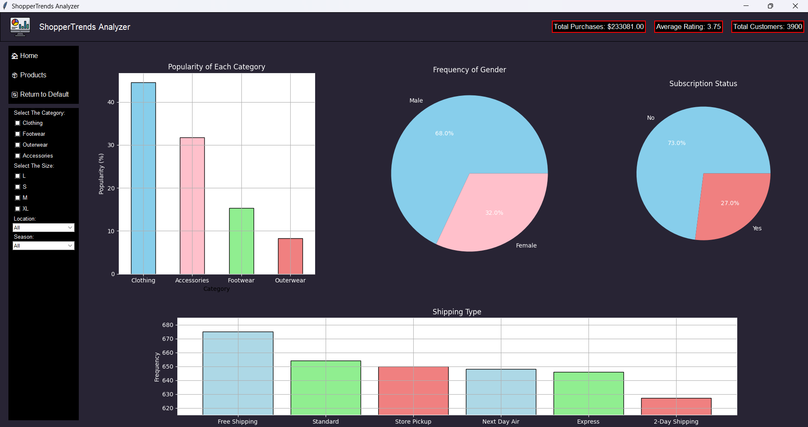

# ShopperTrends-Analyzer

[How to Install](https://github.com/Dogoh48/ShopperTrends-Analyzer/wiki/How-to-Install)

## Description

ShopperTrends-Analyzer is a data analysis and visualization tool designed to provide valuable insights into customer shopping preferences and behavior. With a comprehensive dataset encompassing various customer attributes such as age, gender, purchase history, preferred payment methods, and feedback ratings, ShopperTrends-Analyzer enables businesses to understand their customer base better and make informed decisions to enhance their products and services.

